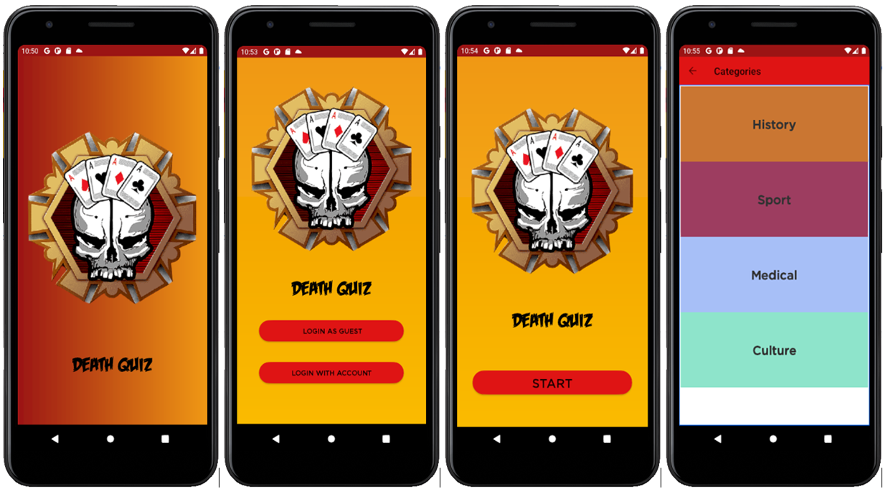
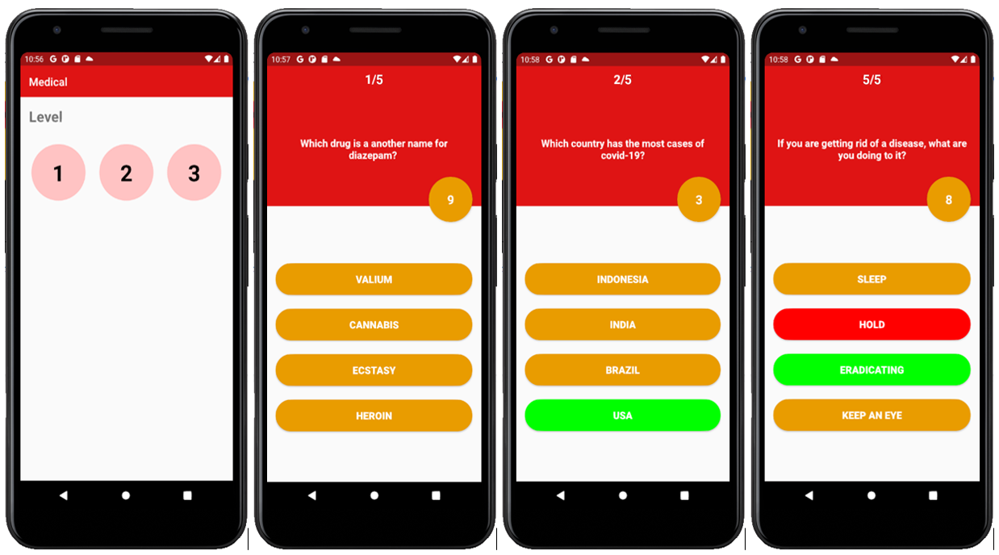
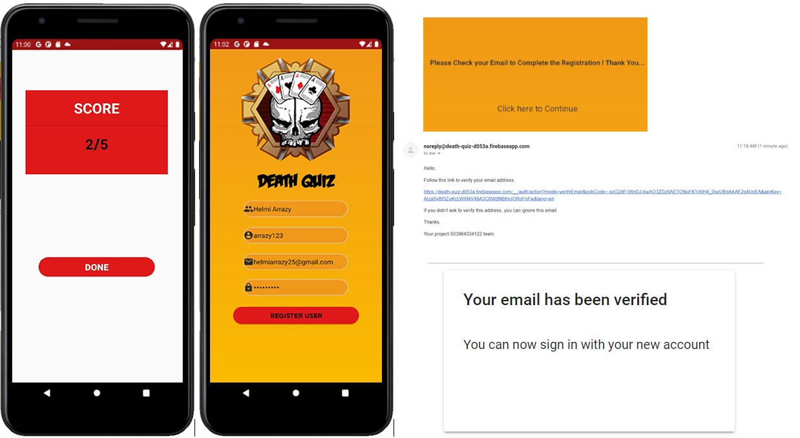
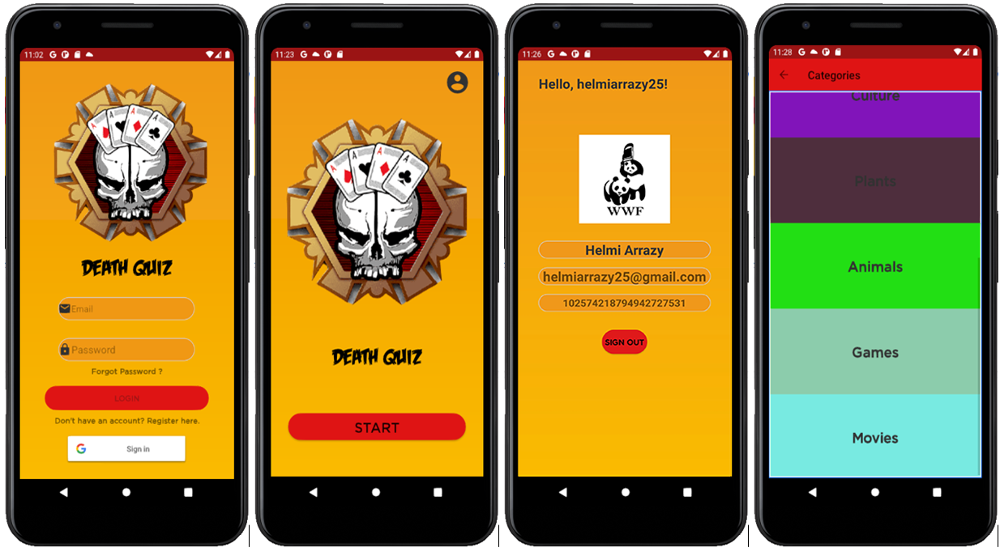

# DeathQuiz

**Proyek Mata Kuliah Rekayasa Perangkat Lunak (RPL)**

**Universitas Indonesia, Fakultas Teknik, Teknik Komputer 2018**

**Judul Aplikasi : "Death Quiz"**

Death Quiz merupakan sebuah aplikasi kuis (multiple choice quiz) berbasis android, dimana mempunyai beberapa pilihan kategori dan level kuis yang dapat dipilih oleh user. Informasi kredensial user, level kuis, kategori kuis, serta kumpulan soal kuis disimpan dan diolah melalui firebase yang berperan sebagai database aplikasi. Untuk level kuis, semakin tinggi level yang dipilih oleh user, maka soal yang diberikan juga akan semakin sulit.  Dari setiap soal kuis yang ditampilkan ada timer (pewaktu) selama 10 detik, sehingga jika user tidak menjawab soal tersebut dalam waktu 10 detik, maka akan langsung dipindahkan ke soal berikutnya. Hal ini berarti user tidak mendapatkan poin dari soal tersebut. Jawaban benar yang dipilih oleh user akan duberi tanda berwarna hijau, sedangkan jika jawaban yang dipilih oleh user salah, maka akan diberi tanda berwarna merah. Pada akhir kuis akan ditampilkan score yang berhasil didapatkan.

Aplikasi ini ditujukan kepada siapa saja yang ingin mengisi waktu luangnya untuk menguji dan menambah wawasannya melaui soal - soal kuis yang diberikan pada aplikasi. Aplikasi ini bisa digunakan dimana saja selama terhubung ke internet, karena untuk mengakses soal - soal kuis yang ada di database membutuhkan akses internet.

Perbedaan signifikan antara login sebagai tamu dengan login dengan menggunakan akun yaitu ada pada fitur kategori kuis, dimana akan ada pilihan kategori kuis yang lebih banyak jika memilih opsi login dengan menggunakan akun.

**Screenshot Program Aplikasi :**

